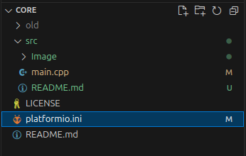
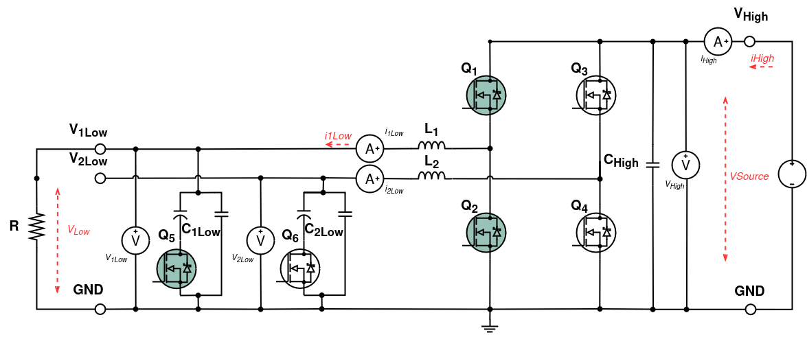
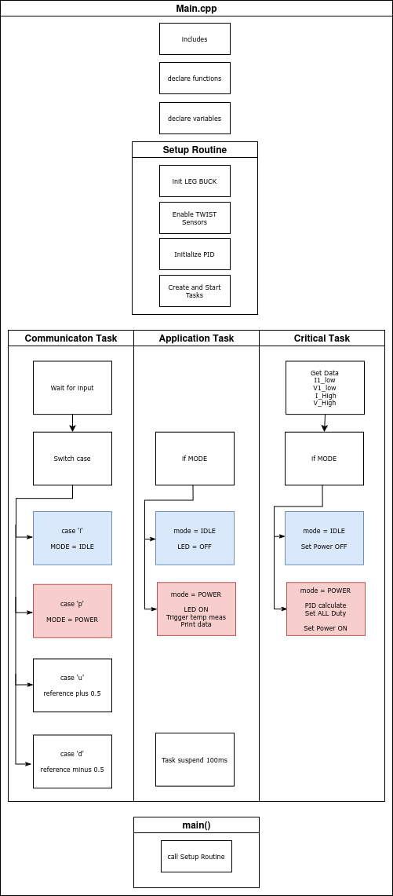
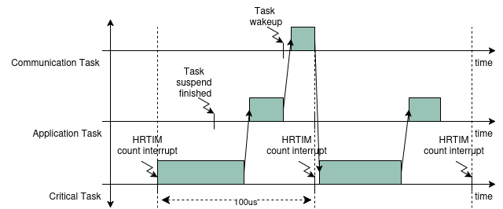
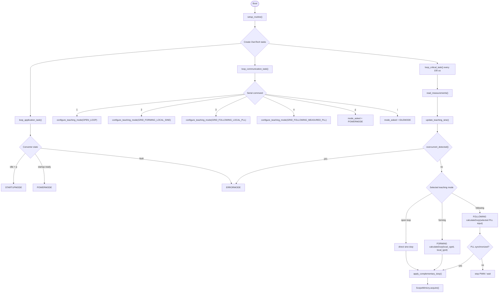
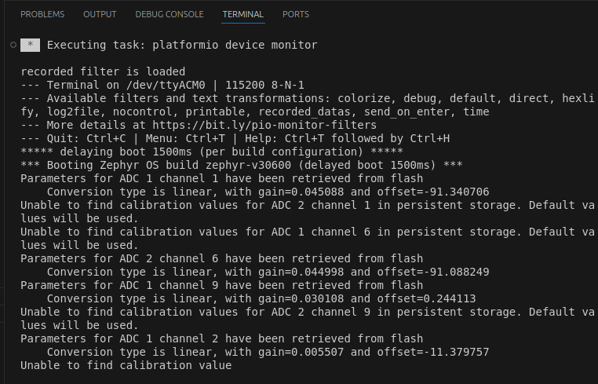
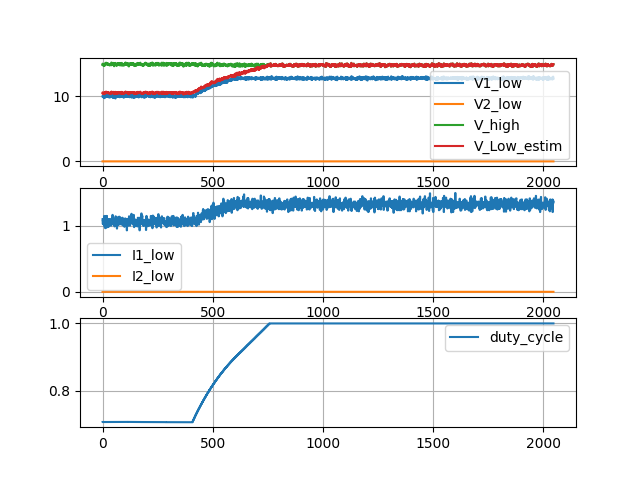

# Single-Phase Inverter Teaching Example

This example turns the TWIST hardware into a single-phase inverter teaching platform. The default `src/main.cpp` contains four runtime-selectable modes:

- `1`: open-loop sine PWM.
- `2`: grid-forming with a locally generated teaching sine.
- `3`: grid-following where the PLL locks to the locally generated teaching sine.
- `4`: grid-following where the PLL locks to the measured `V1_LOW - V2_LOW` voltage.

The standalone files `main_open_loop.cpp`, `main_grid_forming.cpp`, and `main_grid_following.cpp` split these behaviors into smaller examples. This README documents the all-in-one `main.cpp` version.

Key operating conditions in the current code:

- Control period `Ts = 100 us` for the critical task.
- Fundamental frequency `f0 = 50 Hz`.
- Default local teaching sine amplitude `20 V`.
- Load model `LOAD_RESISTANCE = 10 ohm`.
- Current protection threshold `8 A`.
- Duty-cycle clamp `[0.1, 0.9]`.

!!! attention Getting ready
    Make sure you already went through the [environment setup](https://docs.owntech.org/core/docs/environment_setup/) so that PlatformIO, the OwnTech libraries, and the TWIST board support packages are installed.

## Project Files

The main implementation lives in `src/main.cpp`. The PlatformIO application-specific configuration lives in `src/app.ini`, which is included from the root `platformio.ini`.



Use the default `USB` environment to build the all-in-one example:

```bash
/home/luiz-villa/.platformio/penv/bin/pio run -e USB
```

## Hardware Setup

Connect the DC source, resistive load, TWIST board, and USB link as shown below. The firmware assumes that the default TWIST measurement channels are available: `I1_LOW`, `I2_LOW`, `V1_LOW`, `V2_LOW`, and `V_HIGH`.


The circuit below shows the measurement points used by the firmware. The measured grid voltage is computed as `Vgrid_meas = V1_LOW - V2_LOW`, and the measured grid current is taken from `I1_LOW`.



## Software Architecture

The firmware uses the OwnTech task model:

- `setup_routine()` configures PWM, sensors, capacitors, scope channels, and the `singlePhaseInverter` instance.
- `loop_communication_task()` handles serial commands.
- `loop_application_task()` runs the low-rate state machine and telemetry printing.
- `loop_critical_task()` runs every 100 us, reads sensors, updates the selected control mode, applies protection, updates PWM, and records scope data.



The critical task is the only place where PWM commands are updated. Background tasks handle serial control and status reporting without blocking the 10 kHz control loop.



## Operating Modes

| Mode | Serial key | Inverter library mode | Input source | Purpose |
|------|------------|-----------------------|--------------|---------|
| Open loop | `1` | none | local sine | Direct sine PWM without closed-loop control |
| Grid forming | `2` | `FORMING` | local sine voltage/current | Voltage-oriented inverter behavior |
| Following, local PLL | `3` | `FOLLOWING` | local sine voltage/current | PLL demonstration without external measurement dependency |
| Following, measured PLL | `4` | `FOLLOWING` | `V1_LOW - V2_LOW`, `I1_LOW` | PLL locks to measured grid signals |

Changing mode forces the converter back to idle, stops PWM, clears synchronization state, and reinitializes the inverter controller.

## Control Strategies

### Open Loop

Open-loop mode generates the teaching sine locally:

```cpp
teaching_theta = ot_modulo_2pi(teaching_theta + W0 * TS);
local_vgrid = local_voltage_amplitude * ot_sin(teaching_theta);
```

The duty command is calculated directly from the local voltage and DC bus estimate:

```cpp
delta_duty_cycle = 0.5F + local_vgrid / (2.0F * control_bus_voltage());
```

This mode is useful for checking PWM polarity, duty clamping, serial commands, and scope acquisition before enabling closed-loop behavior.

### Grid Forming

Grid-forming mode initializes `singlePhaseInverter` with `FORMING`. The controller receives the local teaching sine voltage and the matching resistive-load current estimate:

```cpp
delta_duty_cycle = inverter.calculateDuty(local_vgrid, local_igrid);
```

The `d`-axis voltage reference is adjusted with the serial tuning keys. In forming mode, increasing `Vdq_ref.d` also updates `local_voltage_amplitude` so the generated teaching signal and voltage reference stay aligned.


### Grid Following

Grid-following mode initializes `singlePhaseInverter` with `FOLLOWING`. The PLL input is selected by the teaching mode:

- Local PLL mode feeds `calculateDuty(local_vgrid, local_igrid)`.
- Measured PLL mode feeds `calculateDuty(Vgrid_meas, Igrid_meas)`.

Power is enabled only after `inverter.getSync()` is true and the estimated frequency remains within the 50 Hz tolerance. If synchronization is lost for too long, the firmware returns to idle and stops PWM.


## Code Flow



## Serial Console Interaction

- `h` prints the mini help menu.
- `p` requests power mode.
- `i` returns to idle and disables PWM.
- `1` selects open-loop sine PWM.
- `2` selects grid-forming with local sine.
- `3` selects grid-following PLL with local sine.
- `4` selects grid-following PLL with measured voltage/current.
- `u/j` adjust the active reference by a small step.
- `d/c` adjust the active reference by a large step.
- `t` triggers scope capture.
- `r` retrieves the captured scope data.

Open the serial monitor after flashing:


During operation, the serial output reports state, selected teaching mode, sync status, DC bus voltage, measured grid voltage, local sine voltage, references, and PLL frequency.




## Expected Behavior

- In open-loop mode, `duty_cycle_1` and `duty_cycle_2` should be complementary sine PWM commands clamped to `[0.1, 0.9]`.
- In grid-forming mode, the inverter should synthesize the local 50 Hz voltage reference through `singlePhaseInverter` in `FORMING` mode.
- In local grid-following mode, the PLL should synchronize to the firmware-generated teaching sine before PWM starts.
- In measured grid-following mode, the PLL should synchronize to `V1_LOW - V2_LOW` before PWM starts.
- Any overcurrent above 8 A should enter `ERRORMODE` and stop PWM.

Scope channels expose the selected mode, converter state, measured voltage/current, local teaching voltage/current, duty cycles, `dq` values, PLL angle/frequency, and sync status.


