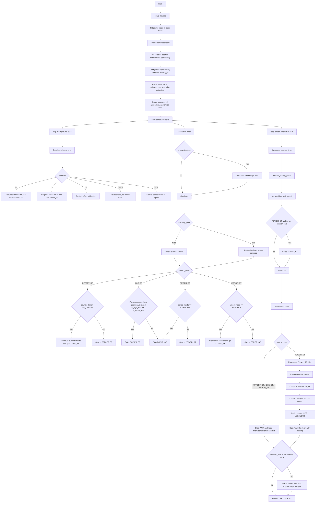

# BLDC FOC With Selectable Position Sensor

This example runs the same cascaded control structure with any of the position sensors already wired on the Ownverter shield:

- Hall
- ABZ incremental encoder
- Sin/Cos analog sensor

The sensor selection is done entirely from the devicetree overlay. `src/main.cpp` now reads the active sensor through `PositionAPI` and only uses ABZ-specific count data when the selected sensor is actually `ABZ`.

## Files

- `src/hall.overlay`: turnkey Hall configuration
- `src/abz.overlay`: turnkey ABZ configuration
- `src/sincos.overlay`: turnkey Sin/Cos configuration
- `src/app.overlay`: active overlay used by the build
- `src/main.cpp`: state machine, task entry points, and runtime sequencing
- `src/app.h`: helper declarations plus the shared `AppContext`
- `src/app.cpp`: helper implementations used by `main.cpp`

`AppContext` is intentionally split into:

- `AppSetup`: values chosen for configuration and initialization
- `AppVariable`: values updated while the application is running

This keeps the state machine readable because setup-oriented variables are not
mixed with measurements, loop counters, and live control data.

## How To Select The Sensor

1. Copy one of the provided overlays onto `src/app.overlay`.
2. Adjust motor and sensor parameters if needed.
3. Build and flash.

Example:

```bash
cp src/abz.overlay src/app.overlay
```

## Overlay Content

Each overlay:

- selects the sensor through `/chosen/owntech,position-sensor`
- sets `&default_motor { pole-pairs = <...>; }`
- overrides the sensor-specific parameters on the shield node already declared by `ownverter_v1_1_0.overlay`

The hardware pin mapping remains the one defined by the shield:

- Hall: spin header pins `7`, `9`, `49`
- ABZ: timer `timers3`
- Sin/Cos: `ANALOG_SIN` on pin `43`, `ANALOG_COS` on pin `45`

## Parameters To Check

Before running the motor, verify these values in the chosen overlay:

- `pole-pairs`
- `direction-sign`
- `electrical-offset`
- `counts-per-revolution` for ABZ
- `hall-sector-table` and `hall-interpolation` for Hall

`electrical-offset` is stored as the raw IEEE754 `float32` bit pattern expected by the binding. `0x00000000` means `0.0f`.

## Runtime Behavior

`main.cpp` uses `shield.position.initDefault()` and expects the selected overlay to define the active sensor. The control only enters `POWER_ST` when:

- the position sensor initialized correctly
- the position update is valid
- the DC bus voltage is above the startup threshold

If position feedback becomes invalid while running, the control falls back to `ERROR_ST` instead of continuing with stale rotor angle data.

The runtime state machine and protections stay in `main.cpp`, while the FOC
math path is now delegated to the calculation-only `motor_control` library
under `owntech/lib/USB/motor_control`.

## Control Flow



## Serial Commands

- `p`: request power mode
- `i`: request idle mode
- `o`: restart current offset calibration
- `u`: increase speed reference
- `d`: decrease speed reference
- `r`: dump scope data
- `q`: restart scope acquisition
- `m`: toggle buffered scope replay

## Hall Notes

The default Hall sector table is:

```text
{5, 1, 0, 3, 4, 2}
```

This maps raw Hall states `001` to `110` to electrical sectors. If your motor phases or Hall wiring are permuted, this table or `direction-sign` may need adjustment.

## Phase Mapping

| Electrical phase | PWM  | LEG  |
|------------------|------|------|
| Phase A          | PWMA | LEG1 |
| Phase B          | PWMC | LEG2 |
| Phase C          | PWME | LEG3 |
