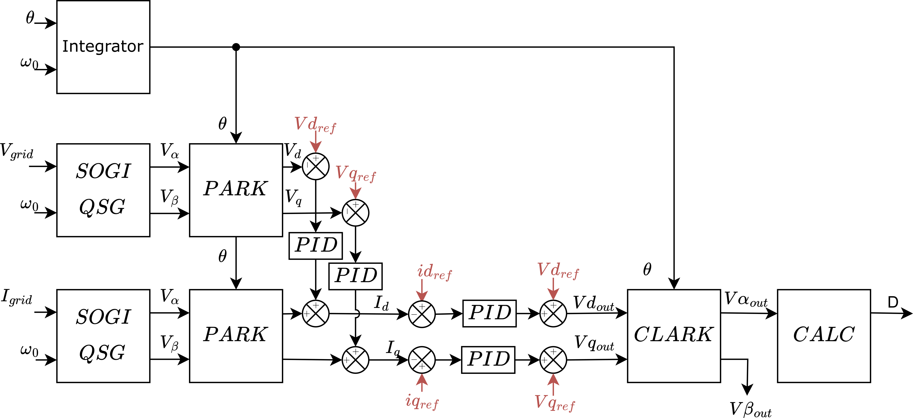

# Single Phase Inverter

This example turns the TWIST hardware into a single-phase voltage-source inverter that can either **form** an islanded grid or **follow** an existing grid. The firmware in `src/main.cpp` coordinates OwnTech Task, Shield and Spin APIs to acquire measurements, run digital signal processing, compute PWM duty cycles and stream data/telemetry.

Key operating conditions:

- `UDC = 60 V` DC bus (the code ramps to half the bus before enabling the bridge)
- Resistive load of `20 Ω`
- Control period `Ts = 100 µs` (10 kHz) for the critical task
- Fundamental frequency `f0 = 50 Hz`

!!! attention Getting ready
    Make sure you already went through the [environment setup](https://docs.owntech.org/core/docs/environment_setup/) so that PlatformIO, the control library dependency and the TWIST board support packages are installed.

## Hardware Setup

- Connect the 60 V DC source to the `VHIGH` terminals and the neutral point to the board ground.
- Attach the 20 Ω load between the inverter output terminals (L1/L2). The firmware assumes a balanced resistive load when computing the duty-cycle offset.
- Ensure current/voltage sensing wiring matches the default TWIST harness so that `I1_LOW`, `I2_LOW`, `V1_LOW`, `V2_LOW` and `V_HIGH` channels are valid.
- Disconnect the DC link capacitors through software (`shield.power.disconnectCapacitor`) during setup; the code reconnects them once the PWM ramps in `STARTUPMODE`.



## Software Architecture

### Task Breakdown

- **`setup_routine`** configures sensors, instantiates the `singlePhaseInverter`, initializes SOGI filters and PID controllers, sets up the scope buffer and starts the high-frequency critical task.
- **`loop_communication_task`** waits for keyboard commands (`i`, `p`, `u`, `j`, `d`, `c`, `h`) received over the console to change operating modes or tune references.
- **`loop_application_task`** bridges requested modes to the state machine, blinks LEDs through the Spin API and prints telemetry snapshots.
- **`loop_critical_task`** runs every 100 µs; it samples ADCs, executes the control law, updates PWM duty cycles and records scope data.

The real-time work happens inside `loop_critical_task()`, which calls into the `singlePhaseInverter` helper to perform Clark/Park transforms, PR controllers and saturation logic before sending duty cycles to both legs.

### Operating Modes

| Mode | Trigger | Purpose |
|------|---------|---------|
| `IDLEMODE` | default, `i` command, desynchronization | PWM disabled, measurements continue |
| `STARTUPMODE` | internal during synchronization | Ramps duty cycle to 0.5 and synchronizes when following a grid |
| `POWERMODE` | `p` command | PWM enabled, inverter follows the selected control strategy |
| `ERRORMODE` | current limit exceeded | PWM immediately disabled |

The `local_mode` variable selects one of two strategies:

- `FORMING` maintains a sinusoidal voltage reference (grid forming).
- `FOLLOWING` locks to an external grid using SOGI-based phase estimation and regulates injected current (grid following).


## Control Strategies

| Component | Grid Forming | Grid Following |
|-----------|--------------|----------------|
| Reference | Voltage amplitude `Vdq_ref` adjusted with `u/j/d/c` commands | Current amplitude `Idq_ref` adapted via the same keys |
| Feedback | `Vdq_in` from Park transform of measured voltages | `Idq` from Park transform of measured currents |
| Loop type | Dual PI (`pi_voltage_d`, `pi_voltage_q`) with saturation to `±UDC` | Dual PI (`pi_current_d`, `pi_current_q`) limiting current to protect the load |
| Phase | Integrator on `theta` adds feed-forward angle based on `omega = 2πf0` | `Sogi` extracts fundamental components, computes phase and frequency, and checks synchronization margins (`sync_power_tolerance`) |

Internally, `singlePhaseInverter`:

1. Uses SOGI filters (`sogi_v`, `sogi_i`) to build orthogonal voltage and current components.
2. Transforms the measurements into `αβ` and `dq` frames (`getVab`, `getVdqIn`, `getIdq`).
3. Computes the control error, applies PI controllers and clamps references (`getIdqRefDelta`).
4. Generates symmetric duty-cycle commands with an offset that tracks the measured neutral voltage to keep the midpoint centered.

The firmware also tracks synchronization counters: if the estimated frequency leaves the ±1% band for too long, the system drops back to `IDLEMODE` for safety.

## Code Flow

```mermaid
flowchart TD
    boot([Boot]) --> setup[setup_routine()]
    setup --> createTasks{Tasks running?}
    createTasks -->|yes| comm(loop_communication_task)
    createTasks --> app(loop_application_task)
    createTasks --> crit(loop_critical_task @ 100 µs)
    comm --> modeChange{Mode request}
    modeChange -->|p| powerMode
    modeChange -->|i| idleMode
    crit --> sense[Acquire ADC measurements]
    sense --> control[singlePhaseInverter.inputProcessing()]
    control --> strategy{Grid forming?\n(local_mode)}
    strategy -->|yes| form[Voltage PI -> duty]
    strategy -->|no| follow[Current PI -> duty]
    form --> pwm[Update PWM legs]
    follow --> pwm
    pwm --> scope[ScopeMimicry.acquire()]
    app --> telemetry[Print telemetry / LED status]
    telemetry --> comm
```

## Serial Console Interaction

- `h` prints the mini help menu.
- `p` enters `POWERMODE` (enables PWM once synchronization / ramp is complete).
- `i` forces `IDLEMODE` and disables PWM.
- `u/j` tweak the d-axis reference by ±1 unit (volts or amps depending on mode).
- `d/c` tweak the d-axis reference by ±5 units.

While running, the application task streams compact telemetry in both idle and power states. Captured data can be post-processed with `ScopeMimicry` and the helper script `src/plot_NLM_results.py`.

## Expected Behaviour

With a 60 V DC bus and a 20 Ω load:

- In grid-forming mode the inverter synthesizes a 50 Hz sine output; the duty-cycle offset maintains the midpoint close to 30 V.
- In grid-following mode the inverter first synchronizes using the SOGI estimator before starting PWM. If the measured frequency deviates beyond ±1% for more than 200 iterations, the firmware returns to `IDLEMODE`.
- Scope channels monitor currents (`Id`, `Iq`, `Ialpha`, `Ibeta`), voltages (`Vd`, `Vq`, `Vα`, `Vβ`) and PWM duty cycles, making it easy to cross-check the control performance against the grid-forming/following diagrams above.
