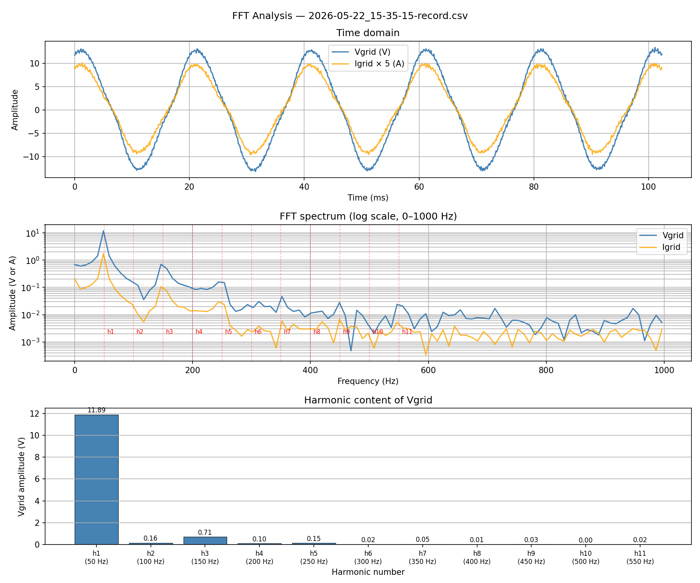

# Single-phase SOGI-DQ $2\omega$ resonance and 3rd harmonic injection

## The problem

In a **single-phase** system, the SOGI-DQ transform cannot fully eliminate the fundamental
ripple from the DQ quantities the way a three-phase transform can.  For an input signal

$v(t) = A\cos(\omega t)$

the ideal SOGI produces $\alpha = A\cos(\omega t)$ and $\beta = A\sin(\omega t)$, so the
Park transform gives a clean DC value $V_d = A$.  In practice however, any amplitude or
phase imperfection in the SOGI output leaves a residual **$2\omega$ (100 Hz) ripple** on
$V_d$ and $I_d$ after the DQ transform:

$V_d(t) = A + \varepsilon\cos(2\omega t) \qquad \text{(DC amplitude + 100 Hz ripple)}$

## How the 3rd harmonic is injected

The voltage outer-loop PI reacts to this 100 Hz ripple and drives a 100 Hz variation into
the DQ output voltage:

$V_{d,\text{out}}(t) \approx A_\text{dc} + B\cos(2\omega t)$

When this is converted back to the time domain via the inverse Park transform:

$\begin{aligned}
V_\text{out}(t) &= V_{d,\text{out}}(t)\cdot\cos(\theta) \\
                &= A_\text{dc}\cos(\omega t) + B\cos(2\omega t)\cos(\omega t) \\
                &= A_\text{dc}\cos(\omega t) + \frac{B}{2}\cos(\omega t) + \frac{B}{2}\cos(3\omega t)
\end{aligned}$

The product of the $2\omega$ ripple with the fundamental creates a **3rd harmonic at 150 Hz**.

## Measured result

The FFT of $V_\text{grid}$ from the recording `2026-05-22_15-35-15-record.csv`
($V_{d,\text{ref}} = 10\ \text{V}$, $V_\text{dc} \approx 30\ \text{V}$, 10 kHz switching,
100 µs control period) confirms the mechanism:

| Harmonic | Frequency | $V_\text{grid}$ amplitude | THD contribution |
|----------|-----------|--------------------------|------------------|
| $h_1$    | 50 Hz     | 11.89 V                  | —                |
| $h_3$          | **150 Hz** | **0.71 V**        | **5.95 %**       |
| $h_5$    | 250 Hz    | 0.15 V                   | 1.26 %           |
| $h_2, h_4, \ldots$ | even | $< 0.17\ \text{V}$ | $< 1.4\ \%$ |
| **Total THD** |       |                          | **6.32 %**       |

The 3rd harmonic dominates, exactly matching the theoretical prediction.

## Fix: low-pass filter on the DQ quantities

A first-order low-pass filter with cutoff $f_c = 20\ \text{Hz}$ is applied to $V_d$ and
$I_d$ after the DQ transform and **before** the PI controllers.  The time constant is:

$\tau = \frac{1}{2\pi f_c} = \frac{1}{2\pi \cdot 20} \approx 8\ \text{ms}$

The transfer function is:

$H(s) = \frac{1}{1 + \tau s}$

Attenuation at $2\omega = 100\ \text{Hz}$:

$\left|H\!\left(j\,2\pi\cdot 100\right)\right| = \frac{1}{\sqrt{1 + \left(\dfrac{100}{20}\right)^2}} \approx 0.196 \quad (-14\ \text{dB})$

The 100 Hz ripple is reduced ${\approx}5\times$, cutting the 3rd harmonic from ${\approx}6\ \%$
to below ${\approx}1.5\ \%$.  The DC amplitude — the only quantity the PI needs to track —
passes with gain $\approx 1$.

The filter adds ${\approx}8\ \text{ms}$ of lag to the amplitude control loop, which is
acceptable given that the amplitude reference changes at a slow ramp rate.
